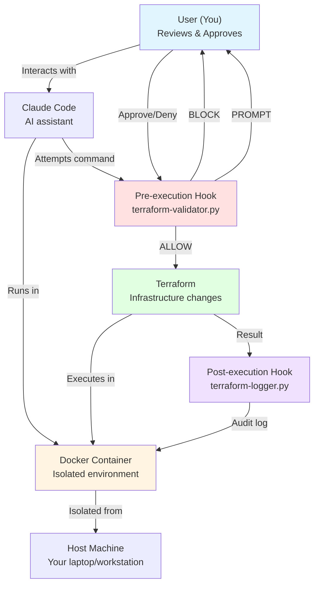

# Claude Code Terraform Safety Hooks

A production-ready pattern for safely using Claude Code with terraform in large infrastructure repositories.

## What This Does

Provides **safety guardrails** that allow SRE teams to use Claude Code for terraform development while maintaining existing change management processes.

**Key Features:**
- Blocks dangerous operations (`terraform apply`, `destroy`, `import`)
- Prompts for explicit approval on all terraform commands
- Creates audit trail of all operations
- Works with terraform aliases and wrapper scripts
- Per-repository configuration

## Quick Start

### 1. Copy to Your Terraform Repository

```bash
# In your terraform repo
git clone https://github.com/your-org/moz-tf-ccode.git /tmp/tf-hooks
cp -r /tmp/tf-hooks/.claude .
cp /tmp/tf-hooks/.gitignore .gitignore  # Or merge if you have one
```

### 2. Test the Hooks

```bash
# Run automated tests
chmod +x .claude/hooks/*.py
./.claude/docs/test-hooks.sh
```

### 3. Customize AGENTS.md for Your Repository

**Option A: Interactive Setup (Recommended)**

Use Claude Code to customize AGENTS.md through a guided questionnaire:

```bash
# Start Claude Code
claude
```

Then paste this prompt:
```
I've just installed the Claude Code terraform safety hooks in this repository.
Help me customize the AGENTS.md file for my team by asking me questions about:

- The infrastructure this repository manages
- Who uses this repository (team composition and experience level)
- Our deployment workflow and approval processes
- Any special conventions or constraints for this repo

Ask me one question at a time. After I answer each question, ask the next one.
When you have enough information, show me a draft of the customized AGENTS.md
sections for my review before making any changes.
```

Claude will guide you through questions and customize the file with your specific infrastructure details.

**Option B: Manual Editing**

```bash
# Edit AGENTS.md directly
vim AGENTS.md  # or use your preferred editor
```

Include:
- What infrastructure this repo manages (GKE clusters, Cloud SQL, networking, etc.)
- Which environments (dev, staging, prod)
- Team conventions and approval requirements
- Links to runbooks or architecture docs

**Note:** This repo uses AGENTS.md (with CLAUDE.md as a symlink) to support multiple AI coding agents. You can use either naming convention in your repos. See [DEPLOYMENT.md](.claude/docs/DEPLOYMENT.md#step-2a-interactive-customization-with-claude-code-recommended) for details on the interactive setup.

### 4. Start Using Claude Code

```bash
claude
```

Ask Claude to help with terraform:
- "Add a new GKE node pool with these specs: ..."
- "Run terraform plan to check what would change"
- "Fix this validation error: [paste error]"

Dangerous commands are blocked automatically. Safe commands prompt for your approval.

## Philosophy: LLM as Intern

Claude Code is your augment, not your replacement. Think of the LLM as an intern:
- You review and approve each action
- You are responsible for the work product
- You submit the final PR and own the changes
- Claude helps you work faster, but you remain the decision maker

## What Gets Blocked

These commands are completely forbidden and will never execute:

```bash
terraform apply          # Must go through PR workflow
terraform destroy        # Extremely dangerous
terraform import         # Modifies state
terraform state rm/mv    # State manipulation
terraform taint/untaint  # Affects future applies
terraform force-unlock   # Breaks locking safety
```

## What Requires Approval

All other terraform commands prompt before execution:

```bash
terraform plan -lock=false   # Primary use case
terraform init               # Module initialization
terraform validate           # Syntax checking
terraform fmt                # Code formatting
terraform state list/show    # Read-only state view
terraform output             # View outputs
```

## Documentation

- **[Quick Start Guide](.claude/QUICKSTART.md)** - Get started in 5 minutes
- **[Usage Guide](.claude/docs/README.md)** - Comprehensive documentation for teams
- **[Testing Guide](.claude/docs/TESTING.md)** - How to test and troubleshoot
- **[Deployment Guide](.claude/docs/DEPLOYMENT.md)** - Rolling out to multiple repos
- **[AGENTS.md](AGENTS.md)** - Project context for AI coding agents (example for your repos, also accessible as CLAUDE.md)

## How It Works

### Technical Implementation

The hooks use Claude Code's native hook system:

1. **Pre-execution validation** (`.claude/hooks/terraform-validator.py`)
   - Intercepts bash commands before Claude runs them
   - Checks against blocked command patterns
   - Prompts user for approval on terraform commands
   - Blocks execution if command is forbidden

2. **Post-execution logging** (`.claude/hooks/terraform-logger.py`)
   - Records command results to audit trail
   - Captures timestamps, exit codes, success/failure
   - Logs stored in `.claude/audit/terraform.log` (gitignored)

3. **Hook configuration** (`.claude/settings.json`)
   - Defines which hooks run and when
   - Committed to git for team consistency
   - Can be customized per repository

### Why Hooks, Not Prompts?

Hooks provide **technical enforcement** rather than relying on Claude's behavior:
- System-level blocking before command execution
- Claude cannot disable or bypass hooks
- Works even if Claude "forgets" the rules
- Auditable and deterministic

### Defense in Depth: Isolation Layers

The safety architecture uses multiple layers of protection when AI assists with infrastructure:



**Key Protection Layers:**
1. **Host Isolation** - Container boundary prevents AI commands from affecting your host machine
2. **Hook Validation** - Pre-execution hook blocks/prompts before any terraform command runs
3. **User Control** - You approve every action; AI cannot proceed without permission
4. **Audit Trail** - Post-execution hook logs all attempts for compliance and review

This multi-layered approach means even if one layer fails, others provide protection.

## Isolated Development Environment (Recommended)

### Why Devcontainer for AI-Assisted Infrastructure

When using AI coding agents with terraform, the devcontainer provides critical isolation and consistency:

**Safety Through Isolation**
- AI-executed commands run in container, not on your host machine
- Container boundary provides additional protection layer beyond hooks
- Filesystem operations are sandboxed to container workspace
- Can destroy/rebuild container if AI operations cause issues
- Network policies can restrict container's outbound connections

**Consistency Across Team**
- Everyone uses identical tool versions (terraform, gcloud, Python)
- Eliminates "works on my machine" issues
- Hooks behave identically across all team members
- No manual installation of 10+ CLI tools

**Complete SRE Toolset**
- Pre-installed: terraform 1.14.3, tflint, terraform-docs, gcloud, kubectl
- Quality tools: shellcheck, pre-commit, gitleaks, bat, ripgrep, yq
- VSCode extensions auto-configured for terraform and Python
- Auto-formatting enabled for all relevant file types

**Security Built-In**
- gitleaks scanner prevents accidentally committing secrets
- Pre-commit framework for additional safeguards
- Isolated environment with network controls
- All hook scripts ready to run immediately

### Using the Devcontainer with VSCode

**Prerequisites:**
- Container runtime (Docker, Podman, Rancher Desktop, etc.) installed and running
- VSCode with "Dev Containers" extension

**Quick start:**

1. Open this repository in VSCode
2. Click the blue "Reopen in Container" prompt, or
3. Command palette: "Dev Containers: Reopen in Container"

**First build takes a few minutes. Subsequent starts are fast (cached).**

Once running:
- All tools are ready immediately
- Claude Code extension runs in container context
- Hooks execute in container Python environment
- Terraform commands execute in isolated container

### Using the Dockerfile Without VSCode

If you're not using VSCode, you can build and use the Docker image directly:

```bash
# Build the image
cd .devcontainer
docker build -t terraform-sre:local .

# Run interactive shell in container
docker run -it --rm \
  -v $(pwd):/workspace \
  -w /workspace \
  --cap-add=NET_ADMIN \
  --cap-add=NET_RAW \
  terraform-sre:local /bin/zsh

# Inside the container, hooks work the same way
terraform plan
```

**Note:** When using the Dockerfile directly, you'll need to manually configure credential mounting and environment variables that devcontainer.json normally handles.

### Devcontainer Architecture

The devcontainer complements the hook system by adding a process-level isolation layer:

**Without devcontainer:**
```
Your host machine → Claude Code → Hooks → Terraform
```

**With devcontainer (recommended):**
```
Your host machine → Container boundary → Claude Code → Hooks → Terraform
```

The container provides:
- Filesystem isolation (container can't modify host)
- Network isolation (optional restrictions on outbound calls)
- Process isolation (can kill container if needed)
- Version pinning (same terraform/Python for everyone)

**What this protects against:**
- Accidental file modifications outside your workspace
- AI mistakes that could affect your host system
- Unintended command execution impacting local environment
- Version inconsistencies across team members

**What this does NOT protect against:**
- Malicious code intentionally designed to escape containers
- Determined attackers exploiting container escape vulnerabilities
- Social engineering or credential theft
- Bypassing IAM permissions or cloud provider security

**Bottom line:** This is an operational safety layer for AI-assisted development, not a security boundary against malicious actors. Your existing security controls (IAM, state locking, PR reviews) remain essential.

### Alternative: Local Installation

If you prefer not to use devcontainer, install these tools locally:

```bash
# macOS
brew install python3 terraform tflint terraform-docs gcloud kubectl

# Ubuntu/Debian
apt-get install python3 python3-pip
# Then install terraform and cloud tools per vendor docs
```

Ensure Python 3 is available for the hook scripts. Note that tool versions may vary across team members.

### Complete Documentation

See [.devcontainer/README.md](.devcontainer/README.md) for:
- Complete tool inventory and versions
- Customization options (adding tools, changing versions)
- Organizational deployment patterns
- Credential management approaches
- Troubleshooting guide
- Pre-commit integration examples

## Repository Structure

```
.claude/
├── settings.json              # Hook configuration (committed)
├── hooks/
│   ├── terraform-validator.py # Pre-execution validation
│   └── terraform-logger.py    # Post-execution logging
├── docs/
│   ├── README.md              # Main usage guide
│   ├── TESTING.md             # Testing procedures
│   └── DEPLOYMENT.md          # Multi-repo rollout
└── QUICKSTART.md              # 5-minute getting started

.devcontainer/
├── devcontainer.json          # VSCode devcontainer config
├── Dockerfile                 # Container with all SRE tools
├── init-firewall.sh           # Network configuration script
└── README.md                  # Complete devcontainer documentation

.gitignore                     # Excludes audit logs
AGENTS.md                      # Project context for AI coding agents
CLAUDE.md -> AGENTS.md         # Symlink for backwards compatibility
README.md                      # This file
```

## Customization

### Adding Custom Terraform Wrapper Scripts

If your team uses wrapper scripts (like `tfwrapper` in `$PATH`), add them to the validator:

Edit `.claude/hooks/terraform-validator.py`:

```python
# Line 39
TF_COMMAND = r"\b(terraform|tf|tform|tfwrapper)\b"
```

**Note:** Shell aliases (like `alias tf=terraform`) don't need configuration. They don't work in subprocess calls, so they can't bypass hooks anyway.

### Managing Hook Customizations

If you customize the hooks for your organization:

**Track your changes:**
- Document customizations in comments within the hook files
- Consider maintaining a `CUSTOMIZATIONS.md` file listing your changes
- Use git to track changes: `git log .claude/hooks/`

**Upgrading hooks:**
- When this project releases new hook versions, you'll need to manually merge changes
- Keep your customizations minimal to simplify updates
- Consider contributing broadly-useful customizations back to this project

**Multi-repository consistency:**
- Decide if customizations should be per-repo or organization-wide
- For org-wide rules, maintain a canonical hooks repository and copy to other repos
- Document the process for propagating hook updates across your repositories

This is an organizational problem that varies by team structure. Choose an approach that fits your workflow.

### Per-Environment Rules

Different repos can have different rules:
- Dev repos: More permissive (allow terraform apply with extra confirmation)
- Prod repos: Stricter (additional blocked commands)

See [Deployment Guide - Customization](.claude/docs/DEPLOYMENT.md#customization-per-repository) for details.

## Requirements

- **Python 3.x** - For hook scripts (included in devcontainer)
- **Claude Code** - [Download here](https://claude.ai/download)
- **Terraform** - Any version (hooks are terraform-agnostic, devcontainer includes 1.14.3)
- **GCP authentication** - `gcloud auth login` (for terraform to work)
- **Container runtime + VSCode Dev Containers extension** - Optional, for isolated development environment (recommended). Supports Docker, Podman, Rancher Desktop, OrbStack, and compatible runtimes

## FAQ

**Q: Can I still run terraform apply manually?**

A: Yes. The hooks only block Claude Code, not you. Run `terraform apply` directly in your terminal.

**Q: What if hooks cause problems?**

A: Temporarily disable by renaming `.claude/settings.json` to `.claude/settings.json.disabled`. Restart Claude session.

**Q: How do I completely disable the devcontainer and hooks?**

A: To remove all safety mechanisms and run Claude Code directly on your host system:
1. Close VSCode devcontainer (if using)
2. Reopen repository locally (not in container)
3. Remove or rename `.claude/settings.json` to disable hooks

**This is not recommended.** You lose both container isolation and hook validation, returning to direct AI command execution on your host machine. Only do this if you've determined the safety mechanisms don't fit your workflow after thorough evaluation.

**Q: Do I need to authenticate to anything?**

A: Just your normal GCP/AWS/etc. authentication for terraform. The hooks themselves require no additional auth.

**Q: Will this work with Atlantis/Terraform Cloud?**

A: Yes. Hooks are for local development only. Your CI/CD pipeline is unchanged.

**Q: How do I use this devcontainer setup in CI/CD?**

A: CI/CD integration is not covered by this project. The devcontainer and hooks are designed for local development workflows with Claude Code. Your CI/CD pipelines (Atlantis, GitLab CI, GitHub Actions, etc.) should continue using their existing terraform execution environments and approval workflows.

**Q: What about kubectl, helm, gcloud commands?**

A: This repo focuses on terraform. You can adapt the pattern for other tools by modifying the hook scripts.

## Example Workflow

```bash
# 1. Ask Claude to add infrastructure
You: "Add a new Cloud SQL instance for our staging environment"

Claude: [Writes terraform code]

# 2. Review the code changes
You: "Looks good. Run terraform plan to verify"

Claude: "I'll run terraform plan -lock=false"
[PROMPT APPEARS]
Terraform command requires approval:
  Command: terraform plan -lock=false
  Working directory: /path/to/staging
Allow? (y/n)

You: y

[Plan output shows the new Cloud SQL instance]

# 3. Commit and create PR
You: [Handle git operations yourself]
git add .
git commit -m "Add staging Cloud SQL instance"
git push origin feature/staging-cloudsql

# 4. Apply via your standard process
# (After PR approval, Atlantis/CI applies the changes)
```

## Audit Trail

All terraform command attempts are logged with timestamps. Logs are automatically rotated daily:

```bash
# View today's commands
tail -20 .claude/audit/terraform-$(date +%Y-%m-%d).log | jq .

# View all recent commands across dates
cat .claude/audit/terraform-*.log | tail -20 | jq .

# See only blocked attempts from today
cat .claude/audit/terraform-$(date +%Y-%m-%d).log | jq 'select(.decision == "BLOCKED")'

# Example log entry
{
  "timestamp": "2026-01-27T14:30:15.123456",
  "command": "terraform plan -lock=false",
  "decision": "PENDING_APPROVAL",
  "working_dir": "/Users/you/repos/infra-prod",
  "reason": "Awaiting user approval"
}
```

**Log rotation:** Logs are automatically rotated by date (e.g., `terraform-2026-01-27.log`). Old logs persist for your audit needs and can be archived or deleted based on your retention policy.

## Support

**Questions or issues?**
- Review the [documentation](.claude/docs/README.md)
- Check the [troubleshooting guide](.claude/docs/TESTING.md#common-issues-and-solutions)
- Open an issue on GitHub

**Want to contribute?**
- Fork this repository
- Make your changes
- Submit a pull request
- See [AGENTS.md](AGENTS.md) for development guidelines


## Credits

Created for SRE teams managing terraform infrastructure with Claude Code.

Built with safety, auditability, and team confidence as core principles.
